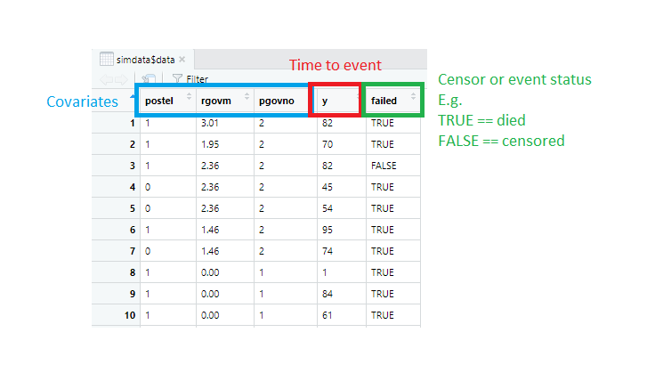

```{r setup, include=FALSE}
knitr::opts_chunk$set(echo = FALSE)
```

# Motivation to write

The article introduces different analysis methods for time-to-event data, and how to conduct these analyses using R. The main motivation of writing this article is to use it as a reference for my future self - to explain why I did what I have done. 

A key inspiration of my work comes from the writing of [Emily Zabor](https://www.emilyzabor.com/tutorials/survival_analysis_in_r_tutorial.html) and her excellent tutorial on survival analysis. Her writing is highly recommended for those who wish to learn more about this technique. 

# TL;DR 
The dataset should look like this

```{r, eval=TRUE, cache=TRUE}
library(coxed)
mv.data <- dplyr::select(martinvanberg, postel, rgovm, pgovno)
simdata <- sim.survdata(T=100, X=mv.data, num.data.frames = 1)
```



The `failed` column contains **both** the event and censor information. 

## Create survival objects 

Use the `Surv` function from the `survival` package. 

```{r, cache=TRUE, echo=TRUE, results=FALSE}

library(survival)
surv_obj <- Surv(simdata$data$y, simdata$data$failed)

```

For **censored subject**, the survival time will have a `+` sign. 

```{r, cache=TRUE, echo=TRUE, results=TRUE}
head(surv_obj)
```

## Kaplan-Meier approach 

Use the `survfit`function for KM analysis and log-rank test for between groups comparison.  

```{r, cache=TRUE, echo=TRUE, results=TRUE}

survdiff(Surv(simdata$data$y, simdata$data$failed)~postel, data = simdata$data)

```

and `ggsurvplot` from `survminer` to create plots. 

```{r, cache=TRUE, echo=TRUE, results=TRUE}

library(survminer)

dat <- as.data.frame(simdata$data)

ggsurvplot(
  fit = survfit(Surv(y, failed)~postel, data = dat),
  xlab = "Days", 
  ylab = "Overall survival probability")

```

# Part 1: Survival vs Hazard Functions (Probabilities) 

We often are interested in how long a person can undergo peritoneal dialysis (PD) without suffering infections to their peritoneum (which causes inflamation, i.e. peritonitis). 

The probability that a person can stay peritonitis-free, or *survive* the time from the start of PD treatment to a specific time *t* in the future, is the *survival probability*. This is represented by the *survivor function* **S(t)**, as below: 

$$S(t)=Pr(T>t)$$
The function indicates the population probability of surviving beyond time *t*. 

## Graphical representation of the survival function 

The survival function can be depicted as a *survival curve*. This is more intuitive to understand the probability of surviving (or in our case, remain peritonitis-free) beyond a certain time *t*. 

```{r, echo=F, warning=F, cache=T}
library(tidyverse) 
library(survival)
library(survminer)

kaplan<- tibble(
  id = c(1:100),
  time = c(100,165,493,86,1804,218,571,389,1645,827,318,833,127,1169,254,1560,129,32,38,100,1227,1353,188,215,502,158,210,78,1588,144,1824,699,157,1058,1476,736,78,265,869,31,936,351,289,465,224,12,3,451,1539,1533,469,30,1484,586,618,29,105,110,73,124,1750,23,68,1099,706,522,566,36,115,165,213,730,603,257,1666,52,1,45,206,114,189,36,343,1270,693,4,421,184,154,769,65,63,42,79,98,121,54,979,434,632), 
  event = c(0,0,1,1,0,1,0,1,1,1,0,0,1,0,1,0,0,0,0,0,1,1,0,0,1,0,0,1,0,0,0,0,1,0,0,0,1,0,1,1,0,1,0,0,0,0,0,0,0,0,0,0,0,1,1,0,0,0,1,0,1,0,1,1,1,1,0,1,0,1,0,0,0,0,0,0,1,0,1,0,1,0,0,0,0,0,1,1,0,0,0,0,0,0,0,0,1,1,1,1), 
  sex = c(2,1,1,2,2,1,1,1,2,2,1.,2,1,1,1,2,2,1,2,2,2,2,1,2,2,2,2,1,2,2,2,1,2,1,1,2,1,2,1,1,1,2,2,2,1,2,2,1,2,2,1,1,2,2,2,2,1,2,2,1,1,1,2,1,1,2,2,1,1,2,2,1,2,1,2,2,2,1,1,1,1,1,2,2,2,1,1,1,2,2,1,2,2,1,1,1,2,1,2,2))

fit <- survfit(Surv(time, event)~sex, data = kaplan)
print(fit)

ggsurvplot(fit,
          pval = TRUE, conf.int = TRUE,
          risk.table = FALSE, 
          #risk.table.col = "strata", 
          linetype = "strata",
          surv.median.line = "hv",
          ggtheme = theme_bw(), 
          #tables.height = 0.3,
          #surv.plot.height=0.9, 
          fontsize=4)
```


